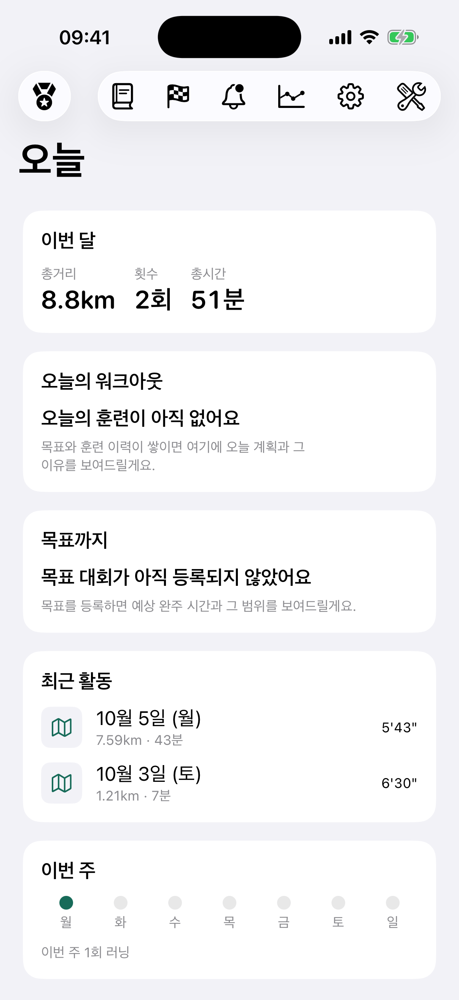
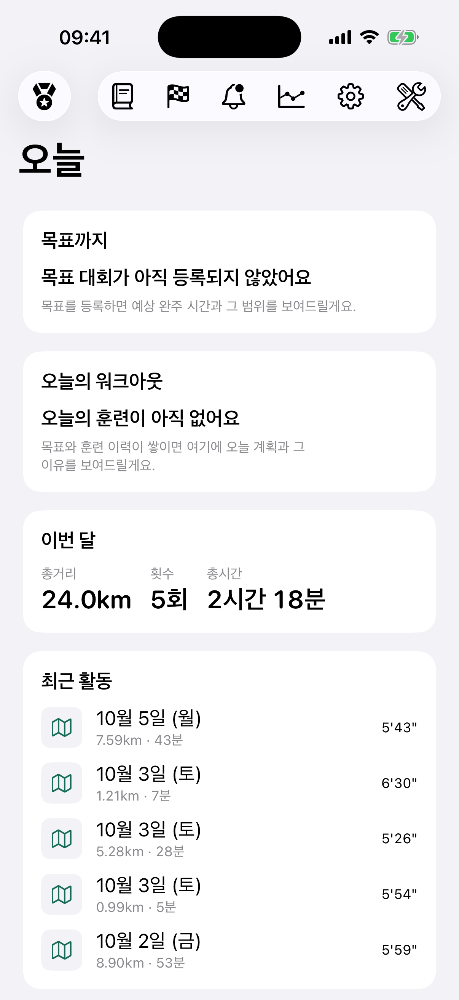

# Showcase 01 — Legs of Steel

**Case status:** `PASS_WITH_WARNING` 
**Viewport:** iPhone 17 Pro · iOS 26.5 · 1206 × 2622 px

## Product intent

Give runners an honest view of the gap to their goal, then connect it to today's training and safety guidance.

## Design problem

The monthly summary appeared before the goal trajectory. The Home screen therefore did not express the product's §13.1 information sequence:

> Goal gap → today's training and safety → supporting statistics

## Design decision

Move the goal progress card to the first position, followed by today's workout and its safety information. Move the monthly summary behind those coaching priorities. Keep existing card styles and behavior.

## Before / After

<table>
  <tr>
    <th>Before · HEAD <code>3a1cf16</code></th>
    <th>After · current working tree build</th>
  </tr>
  <tr>
    <td></td>
    <td></td>
  </tr>
  <tr>
    <td>이번 달 → 오늘의 워크아웃 → 목표까지</td>
    <td>목표까지 → 오늘의 워크아웃 → 이번 달</td>
  </tr>
</table>

Both images are actual simulator captures from the same iPhone 17 Pro / iOS 26.5 viewport (1206 × 2622 px). Before was built from HEAD `3a1cf16` in a detached temporary worktree; After was built from the current LoS working tree. The LoS source repository was not changed to prepare this case.

The current `HomeView.swift` source orders the cards Goal → Workout → Month. The supplied After capture visibly shows Goal → Month in its viewport and does not show the Workout card between them. The capture confirms that Goal is first, but does not visually confirm the Workout card's second position. This mismatch remains unresolved and is recorded as a limitation.

## What changed

- Goal progress moved from third card to first, making the goal gap the first content in the scan.
- Today's workout is second in the screen's content order; its internal growth evidence → prescription reason → safety status order remains intact.
- Monthly distance, activity count, and duration moved to supporting-statistics position.
- Recent activities and weekly streak remain after the coaching content.

The implementation change is a card reorder and matching §17 documentation update. It does not change typography, spacing, color, card styling, data queries, routes, or product logic.

## What stayed unchanged

- Existing interactions and card visibility rules
- Data flow and local account ownership
- Routes and navigation
- Goal calculations, training prescription, growth evidence, and safety decisions
- Existing LoS design tokens and card styles

## Design sources actually used

- **LoS product philosophy:** `marathon-design-v1.0.21.md` §§13.1 and 17, which specify the information priority and Home structure.
- **LoS design system:** `Sources/DesignSystem/LoSTokens.swift`, consulted as the existing spacing, surface, and Dynamic Type typography system to preserve. No token values were changed.
- **Design Team local guidance:** product philosophy takes precedence, select only necessary sources, and verify the rendered output.

No external design engine was run for the original LoS change. DPL did not drive the design decision; this repository records the case from the supplied verification evidence. The implementation followed the product document and preserved existing tokens without external style intervention.

## Sources available but not used

The following sources are available in the Design Team routing inventory. Availability is separate from actual use in this case.

- [DPL](https://github.com/ZestfulPulse/Design_Pattern_Lab) — orchestration and synthesis; **not used to make the LoS design change**. This repository has no `LICENSE` file in the checked-out tree.
- [Huashu Design](https://github.com/alchaincyf/huashu-design) — creative visual direction; **not used**. The upstream repository declares [MIT](https://github.com/alchaincyf/huashu-design/blob/master/LICENSE).
- [UI UX Pro Max](https://github.com/nextlevelbuilder/ui-ux-pro-max-skill) — searchable UI patterns and stack guidance; **not used**. The upstream repository declares [MIT](https://github.com/nextlevelbuilder/ui-ux-pro-max-skill/blob/main/LICENSE).
- [Hallmark](https://github.com/Nutlope/hallmark) — focused web quality review; **not used**. The upstream repository declares [MIT](https://github.com/Nutlope/hallmark/blob/main/LICENSE); its web guidance was not applied to this native iOS screen.
- [Infographic](https://github.com/dataprofessor/infographic) — information-visualization examples; **not used**. No `LICENSE` file was found in the checked upstream checkout, so terms are unconfirmed.
- [Refero](https://refero.design/) — real-product reference research; **not used** because the subscription had expired. DPL's source boundary treats it as research-only and does not permit copying or redistributing its screenshots, logos, or proprietary copy.
- Other external Design Team references — **not used**.

No external reference screenshots, logos, or copied UI assets are included in this case. Upstream license and access details are summarized from the source inventory; confirm current terms before future use.

## Verification

- Before / After simulator captures: completed on iPhone 17 Pro / iOS 26.5 at 1206 × 2622 px. The showcase PNGs are byte-identical to the supplied LoS evidence images.
- Before build: succeeded from HEAD `3a1cf16` in a detached temporary worktree.
- After build: succeeded for iPhone 17 Pro simulator.
- `git diff --check`: passed in the LoS source worktree.
- Tests: **NOT RUN**.
- The visible viewport showed no text clipping. The workout/safety details below the first viewport and the accessibility tree were not verified.

## Known limitations

- Content values changed between captures: Before showed 8.8 km / 2 activities; After showed 24.0 km / 5 activities. These values are not evidence of the design change and are not compared as an outcome.
- On simulator launch, the app's existing startup behavior sent Intervals synchronization requests. HTTP 200 and 422 responses were observed. The difference in activity data means the two captures do not represent an identical data snapshot.
- The After capture's visible card sequence does not match the current source ordering after the Goal card: Month appears next, while the source places Workout next. Do not present the screenshot as visual proof that Workout is second until this discrepancy is independently resolved.
- Workout and safety details are not visible in these captures; their content and the accessibility tree were not verified.
- No tests or accessibility-tree audit were run.
- The Design Pattern Lab repository has not been made public as part of this work.

## Result

**PASS_WITH_WARNING** — The card-priority change is confirmed in the actual rendered Home screen, and both simulator builds succeeded. The activity data changed during the app's startup synchronization, and workout/safety details below the viewport remain unverified. The case does not claim that any unused design engine ran or that the activity-metric changes came from the design.
