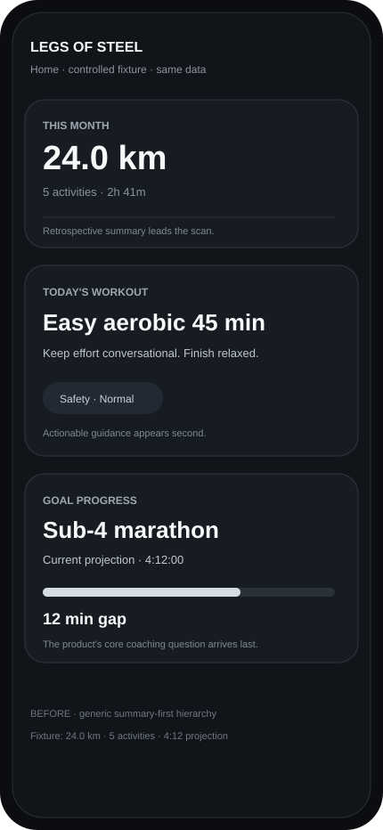
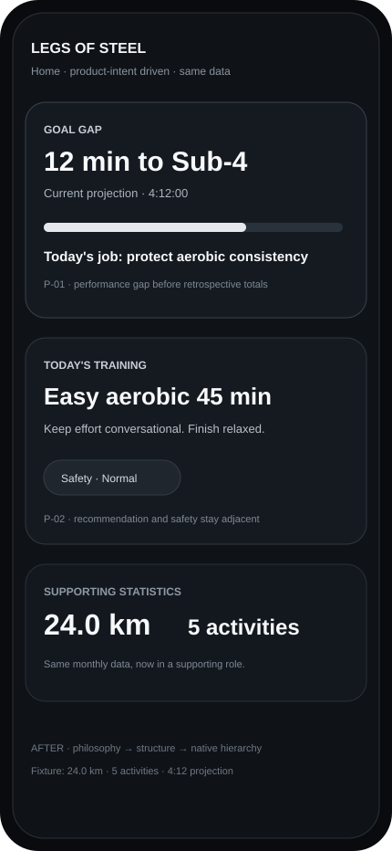

# Showcase 02 — Legs of Steel · Controlled Native Study

**Case status:** `PASS` for the controlled showcase scope  
**Artifact type:** deterministic vector fixture, not a production-app screenshot  
**Platform intent:** iOS / SwiftUI  
**Before/After data:** identical

## Why this showcase exists

Showcase 01 is historically useful, but its Before and After captures used different activity snapshots and did not visually prove the full intended card order.

Showcase 02 removes that ambiguity.

It uses the same controlled fixture on both sides and demonstrates the current DPL pipeline:

```text
Product philosophy
→ Philosophy-to-Design Contract
→ Design Exploration Board
→ Native Pattern Selector
→ structure / visual hierarchy
→ controlled rendered evidence
```

This is a reproducible design study. It does **not** claim that the SVGs are screenshots from the production Legs of Steel app.

## Product philosophy

> Precise personal running analysis, not a generic fitness app.

The Home experience should answer:

1. What is the gap to my goal?
2. What should I do today, and is it safe?
3. What supporting statistics help me understand the context?

## Before / After

<table>
  <tr>
    <th width="50%">Before · summary-first</th>
    <th width="50%">After · product-intent driven</th>
  </tr>
  <tr>
    <td></td>
    <td></td>
  </tr>
</table>

Both renders use exactly:

- 24.0 km monthly distance
- 5 activities
- 2h 41m monthly duration
- Sub-4 marathon goal
- 4:12:00 projection
- 12-minute goal gap
- Easy aerobic 45 min workout
- Safety status: Normal

See [fixture.json](fixture.json).

## Philosophy-to-Design Contract

The controlled case uses two explicit principles:

- **P-01:** Goal gap precedes supporting statistics.
- **P-02:** Today's training and safety belong together before retrospective statistics.

The implementation decisions are traceable:

- **D-01 → P-01:** move goal gap to the first card.
- **D-02 → P-02:** keep today's workout and safety together.
- **D-03 → P-01 + P-02:** move monthly totals into a supporting role.

See [product-intent.yaml](product-intent.yaml).

## Exploration

Two structural directions were compared:

- **A · Summary-first dashboard:** familiar, but reads like a generic fitness dashboard.
- **B · Goal-led coaching instrument:** goal gap → training+safety → supporting statistics.

Direction B was selected because it best expresses the product philosophy without changing the underlying data.

See [exploration-board.yaml](exploration-board.yaml).

## Native Pattern Pack role

The Native Pattern Selector profile favors:

- native fidelity
- interaction rigor
- accessibility
- adaptive layout
- low motion
- high information clarity

For this controlled study, the relevant Native sources are:

- Apple HIG as platform authority
- `design-swiftui-interfaces` as the preferred correctness specialist

`swift-ui-design` is available, but this case intentionally does not require a more expressive visual layer. Restraint is the better product fit.

No claim is made that an external specialist CLI was executed to render these SVG fixtures. The routing decision is documented, while the render itself is a deterministic showcase artifact authored in this repository.

## What changed

- Information hierarchy changed from **summary → action → goal** to **goal → action+safety → statistics**.
- The goal gap gained the strongest visual priority.
- Training and safety became one coherent coaching unit.
- Monthly totals remain available but are visually subordinate.
- The same values and meaning are preserved on both sides.

## What did not change

- Dataset
- Product goal
- Workout prescription
- Safety status
- Business logic
- Routes
- Data contracts
- Dependencies

## Evidence

The two SVG files are text-based deterministic renders committed with the case. They use the exact same values from `fixture.json`.

This removes the two largest limitations of Showcase 01:

1. no data drift between Before and After;
2. the full intended hierarchy is visible in both artifacts.

## Result

**PASS** for the controlled showcase question:

> Does the After artifact express the declared product philosophy more directly than the Before artifact while preserving the same data?

Yes. The goal gap leads, today's training and safety remain adjacent, and monthly totals are explicitly supporting statistics.

This verdict is intentionally limited to the controlled fixture. It is not a claim that the production iOS app has been reimplemented or device-tested by this case.
